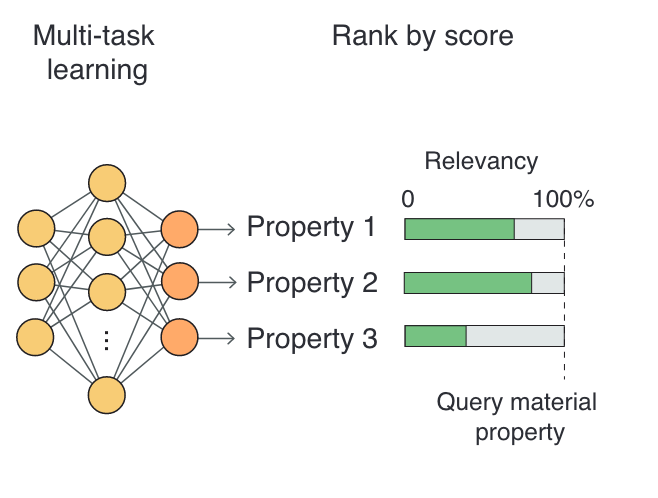
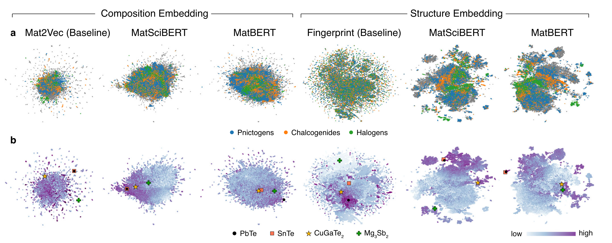
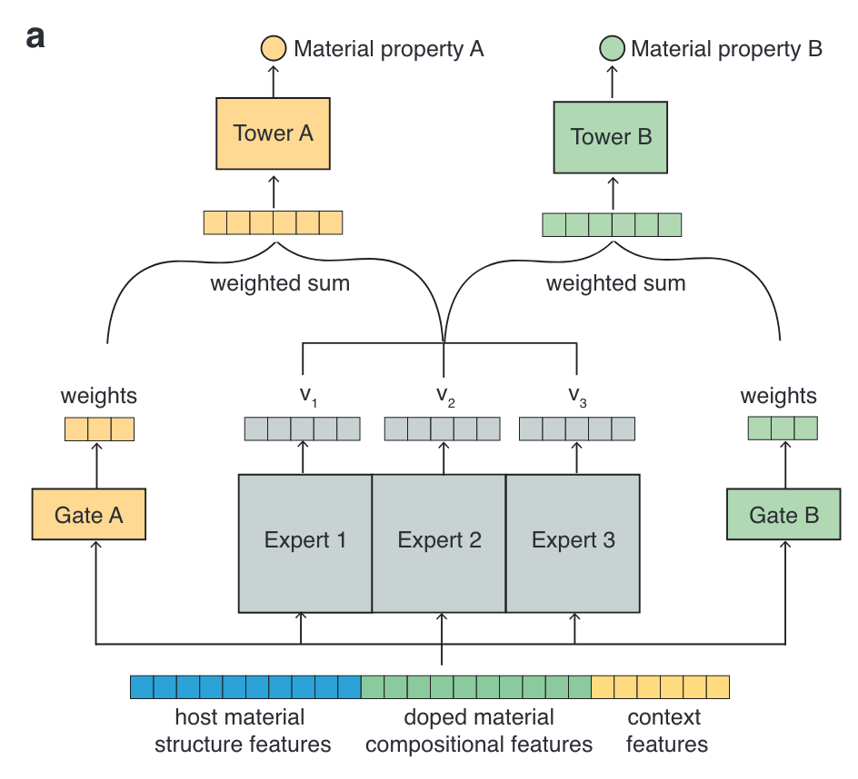
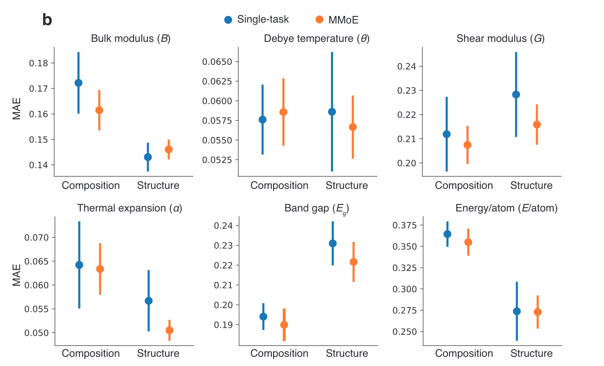

# Leveraging language representation for materials exploration and discovery

## Why discussing this paper? 

I chose Jiaxing et al.'s paper for our journal club because 

- LLMs successfully applied in other domain, interesting to see what can be done in material science
- One among the few paper where LLMs are applied in materials science for actual material discovery. 
- Nice embedding figures

## Context


- Material space is not completely explored. And there is possibility of finding better materials in many applications.

- ML recommender systems for exploring material spaces are already there but not many using "LLMs"

- LLM framework for recommending prototype crystal structures and later validate through first-principles calculations and experiments

- Why LLMs? - Universal task agnostic representations


## Some Previous LLM Models

### MatSciBERT
MatsciBERT was pretrained on whole sections of more than 1 million materials science articles with masked language modelling.

### MatBERT
MatBERT was trained by sampling 50 million paragraphs from 2 million articles masked language modelling.

### Word2Vec
Mat2Vec was trained similarly as Word2vec training through skip-gram with negative sampling. Each word is embedded into a 200-dimensional vector.


## Problem setting

-  Hand-crafted features and specialized structural models have limitations in providing universal and task-agnostic representations within the vast material space.

- Additional contexts are also very useful. for eg: (doping, temperature, synthesis conditions)

- In materials exploration and discovery context: 
(i) effective representations of both chemical and structural complexity, (ii) successful recall of relevant candidates to property of interest
(iii) accurate candidate ranking based on multiple desired functional properties.


## Approach

The authors propose a two-step funnel based approach

- 1. RECALL - Given a material finding similar material from a set of materials
- 2. RANKING - Based on functional properties rank the recalled materials


![ Funnel based recommender framework [@Chen_2024]](Jiaxing_leverage_LLM4mat_images/recommender.png)


### Recalling similar materials

The authors use Robocrystallographer representation to describe the material. Encode the material description using pretrained MatBERT (compared other encoders as well), and use this as a feature vector

- Use a Query material (a well studied known material with property of interest). 

- Encode all material in database and Query material (Robocrystallographer + MatBERT)

- Look at cosine similarity of feature vectors (material in database with Query material)


### Ranking potential materials

Based on multiple properties the recalled materials are ranked.

Usually for any application, and in this paper, for thermoelectric material as well many properties are important hence a ranker based on performance on different functional aspects.

- Author train a Multitask Mixture of Expert Model (MMoEM), using multitask learning to rank the materials.




## Results


The authors perform ablations to understand the importance of the different components of their model. While there are some differences, the differences are not drastic.

### Ablation on Representation suitable for RECALL step

Two set of models 
1. Uses only composition of materials 
`Baseline: Mat2Vec`
    
```{mermaid}
flowchart LR
  A(Composition)--> B(MatBERT)
```

2. Uses Both composition and structure
`Baseline: CrystalNN Fingerprint`

```{mermaid}
flowchart LR
  A(Material)--> B(RoboCrystallographer)--> C(MatBERT)
```

#### Embeddings from composition only and Composition + Structure 

Structure level representations exhibit more distinct separation (well-defined domains) by material groups





For further evaluation, authors  evaluated material embedding performance on downstream property prediction tasks. 

 The task models were multi-layer perceptrons (MLPs) with meanabsolute-error (MAE) training loss. 
 
 The tasks consisted of band gap, energy per atom, bulk modulus, shear modulus, Debye temperature, and coefficient of thermal expansion from AFLOW dataset.


### Finding similar materials

Starting with known materials with favorable properties for TEs such as PbTe, we analyzed the top recalled candidates and found significantly different predicted figure-of-merit zT distributions from selected baseline representations.


### Ranking potential materials

Learning from multiple related tasks provides superior performance over single-task learning by modeling task-specific objectives and cross-task relationships.


In addition to the embeddings derived from language models, the authors added further information based on context (one hot encoded temperature)







## Takeaways

- Might not need a Language model for this task
- Good to see that some of the materials where later tested in lab
- Composition vs Composition + structure not convincing.


