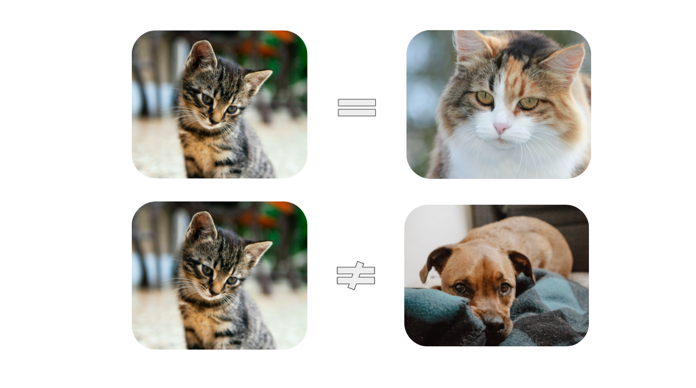
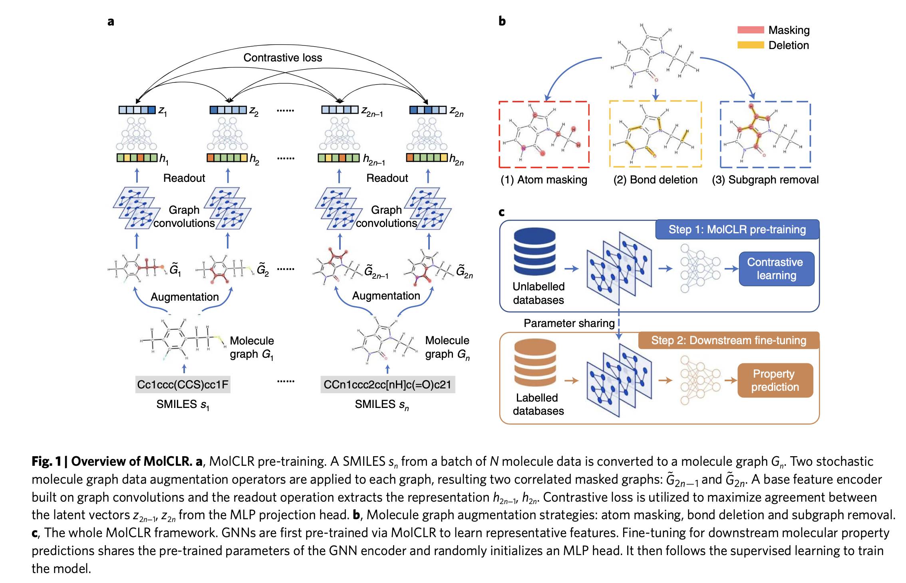
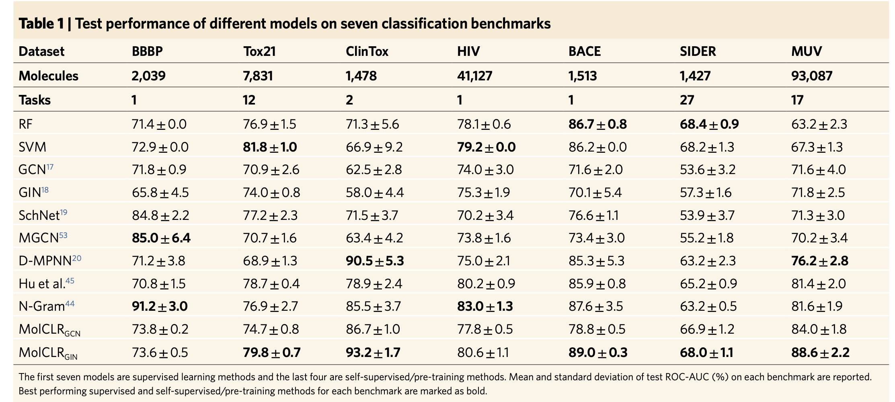
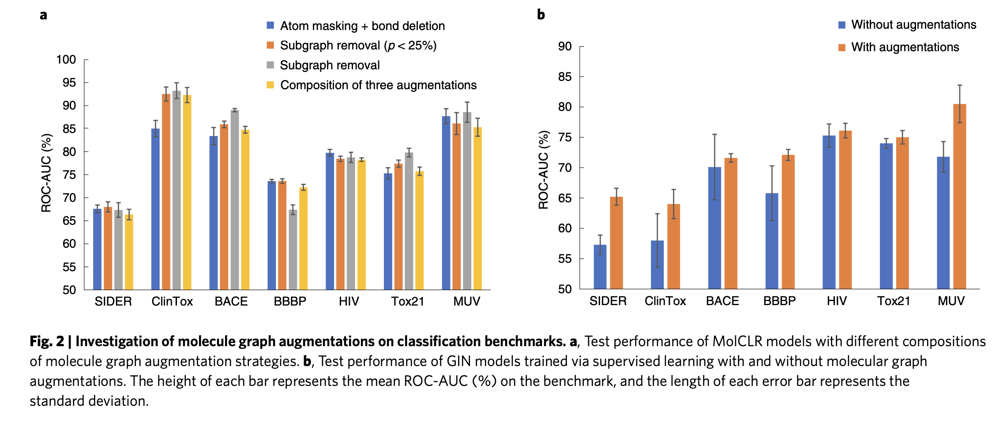
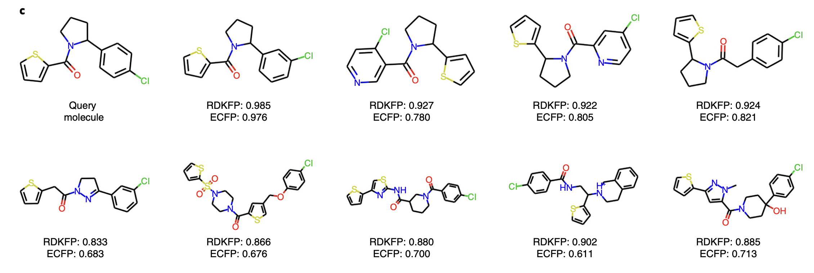

# Molecular contrastive learning of representations (MolCLR) via graph neural networks

## Why discussing this paper? 

I chose Wang's et al.'s paper [@wang2022molecular] for our journal club because

- Supervised learning relies heavily on labeled training data, which can be expensive and time-consuming to obtain.
- Labeled datasets are limited; training models on such datasets might lead to overfitting and poor generalization.
- Self-Supervised Learning (SSL) provides a promising alternative. It enables learning from unlabeled data, which is much easier to acquire in real-world applications and is part of a large research effort.
- SSL learns the inherent structure and patterns in unlabeled data. By doing so, self-supervised models can acquire rich representations and knowledge that can be transferred to downstream tasks, even with limited labeled data.
- Contrastive self-supervised learning, as the name implies, is a self-supervised method that learns representations by contrasting positive and negative pairs.

## Context

The paper introduces MolCLR, a self-supervised learning framework that uses graph encoders to learn differentiable molecular representations.

The authors used a large unlabeled dataset with 10 million unique molecule SMILES from ChemBERTa and PubChem. This framework involves two important steps. First, in the pre-training phase, they build molecule graphs and develop graph neural network (GNN) encoders to learn differentiable representations. Second, the pretrained GNN backbone is used for supervised learning tasks.

## Main idea behind contrastive learning
The aim of contrastive representation learning is to develop an embedding space where similar samples are positioned closely together, whereas dissimilar samples are kept distant from each other.

## NT-Xent loss

The authors use a NT-Xent loss for the contrastive learning.

$$
L_{ij} = -\log \left( \frac{\exp(\text{sim}(z_i, z_j)/\tau)}{\sum_{k=1}^{2N} \mathbf{1}_{\{k \neq i\}} \exp(\text{sim}(z_i, z_k)/\tau)} \right)
$$

- `z_i` and `z_j`: Latent vectors extracted from a positive data pair.
- `N`: Batch size, indicating the number of data pairs used.
- `sim(⋅)`: Function measuring the similarity between two vectors.
- `τ`: The temperature parameter, used to scale the similarity measures in the function.

To get more understanding, [@le2020contrastive] is a review paper on contrastive learning.

## Overview of MolCLR framework

- The SMILES are converted into graphs in a batch. The graphs consist of nodes and edges. Nodes represent atoms, and edges represent the chemical bonds of a molecule.

- The authors studied three types of augmentations: atom masking, bond deletion, and sub-graph removal. These augmentations introduce variance to the model, allowing it to learn different substructures/topologies of the same molecule and generalize well to unseen molecules.

- The GNNs operate based on a message-passing framework. At each node, the local neighborhood information is aggregated and updated iteratively, resulting in node embeddings of the molecule.

- These embeddings are fed into a Multi-Layer Perceptron (MLP) with hidden units to obtain a latent representation of the molecule. The MLP serves as a projection head, mapping the high-dimensional representations from the encoder (GNN) to a lower-dimensional latent space. This projection helps in learning more compact and discriminative representations for the contrastive loss.

- The key difference between supervised GNNs and self-supervised contrastive GNNs is the training objective. In a supervised setup, where we have access to ground truth labels, we can train the network to optimize standard loss functions such as Binary Cross Entropy (BCE) for classification or Mean Absolute Error/Mean Squared Error (MAE/MSE) for regression. In self-supervised contrastive learning, we aim to learn a latent space where positive pairs are closer and negative pairs are further apart.

- The goal is to score the agreement between positive pairs higher than that of negative pairs. For a given graph, its positive pair is constructed using data augmentations, while all other graphs in the batch constitute negative pairs.

For more information about GNNs and their applications, check out this review paper [zhou2020graph].

## Results
The authors tested the performance of MolCLR framework on seven benchmarks for classification tasks and six benchmarks for regression tasks.

The authors claim that on classification tasks with other self-supervised learning or pre-training strategies, their MolCLR framework achieves the best performance on five out of seven benchmarks, with an average improvement of 4.0 percent in (ROC-AUC (%)).

 

The authors also claim that on regression tasks, MolCLR surpasses other pre-training baselines in five out of six benchmarks and achieves almost the same performance on the remaining ESOL benchmark. For the QM9 dataset, MolCLR does not have comparable performancee with SchNet and MGCN supervised models.

## Analysis of molecule graph augmentations
The authors employed four augmentation strategies on the classification benchmarks. Out of four augmentations, sub-graph removal with probability 0.25 achieved good (ROC-AUC %) on all of the classification benchmarks except in the BBBP benchmark as shown in the figure 2.
The reason might be that model structures are sensitive in BBBP benchmark.

They also tested GIN supervised models with and without molecular graph augmentations. With augmentations (sub-graph removal with a probability of 0.25), the model achieved superior performance compared to without augmentations.

## Investigation of MOlCLR representation
The authors examined the representations learned by pretrained MOlCLR using t-SNE embedding. This method groups similar chemicals together in two-dimensional space. In Figure 3, they show a picture of 100,000 molecules from the validation set of PubChem database showing similar/dissimilar molecules learned by MolCLR pretraining. 

For instance, the three molecules on the top possess carbonyl groups connected with aryls. The two molecules on the bottom left have similar structures, where a halogen atom (fluorine or chlorine) is connected to benzene.

Therefore, learned representations are not random but they are meaningful.

In addition to this, the authors also query molecule from the PubcChem with ID 42953211 and the closest nine similar molecules are retrevied along with RDKFP and ECFP similarities labelled. It is observed that these selected molecules share the same functional groups, including alkyl halides (chlorine), tertiary amines, ketones and aromatics. A thiophene structure can also be found in all the molecules.

More examples of query molecules can be found in supplementary information of this paper.

## Take aways 

- Good molecular representations are important for better predictions
- Self-supervised contrastive learning would be an advantage for generalizable machine learning over supervised learning

## References

::: {#refs}
:::